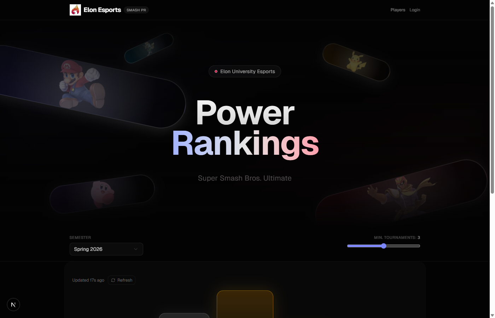

<div align="center">

#  Elon Esports Smash PR

**Super Smash Bros. Ultimate tournament tracker & power rankings**\
*Built for Elon University's esports club*

[](https://nextjs.org)
[](https://supabase.com)
[](https://vercel.com)

<br />



</div>

<br />

## How Scoring Works

Players compete in tournaments — Elon-only weeklies and open regionals alike. The system uses a **weighted average placement** formula where harder competition produces lower (better) scores:

```
weight  = elon_participants / total_participants
score   = placement × weight
average = sum(scores) / tournaments_played
```

| Tournament Type | Example Weight | Effect |
|:---|:---:|:---|
| Elon weekly (10/11) | `0.91` | Placements count a lot |
| Mixed local (5/35) | `0.14` | Rewards showing up against tougher fields |
| Major regional (5/500) | `0.01` | Even mid-pack finishes are impressive |

> **Lower average = higher rank.** A minimum tournament threshold (default 3) filters out one-time participants.

<br />

## Features

### Public

- **Leaderboard** — Animated hero with floating Smash character renders, podium with trophy/medal icons, fireworks, semester selector, min-tournament slider
- **Player Directory** — Search, scatter plot, paginated card/table views (50/page), stats bar
- **Player Profiles** — Stat cards, performance waveform, placement timeline, career journey, head-to-head records, tournament history
- **SEO** — OpenGraph, Twitter cards, dynamic metadata per player profile

### Admin

- **start.gg Import** — Paste a URL, auto-detect singles events, preview standings, flag Elon students, confirm — scores recalculate automatically
- **Manual Entry** — Bracket format selector, virtualized player picker, drag-and-drop placements
- **Player Management** — Elon status toggle per semester, player merge (keeps best placement, migrates sets), start.gg account linking
- **Semester Management** — Auto-create from academic calendar (Spring Jan–Jul, Fall Aug–Dec), overlap validation, tournament reassignment on date changes

### Under the Hood

- **3-batch parallel DB fetches** for player profiles, SSR with `unstable_cache` (60s TTL)
- **Advisory locks** prevent concurrent semester recalculations
- **Deferred set imports** via `after()` — response returns in ~2s instead of ~15s
- **Idempotency guards** on all create operations (duplicate name, tag, event ID, date range)
- **No player deletion** — merge only, preserving tournament history integrity

<br />

## Stack

| | Technology | Purpose |
|:---|:---|:---|
| **Framework** | Next.js 16 | App Router, Server Actions, RSC |
| **Database** | Supabase | Postgres, Auth, RLS |
| **Styling** | Tailwind CSS + shadcn/ui | Dark esports theme |
| **Animation** | Framer Motion | `LazyMotion` + `domAnimation` (~5KB gzipped) |
| **Virtualization** | @tanstack/react-virtual | Large list performance |
| **Deployment** | Vercel | Edge caching, preview deploys |

<br />

## Getting Started

### Prerequisites

- Node.js 18+
- A [Supabase](https://supabase.com) project
- A [start.gg](https://start.gg) API token

### Setup

```bash
git clone https://github.com/drewfoos/ElonEsports-Supabase.git
cd ElonEsports-Supabase
npm install
```

Create `.env.local`:

```env
NEXT_PUBLIC_SUPABASE_URL=https://your-project.supabase.co
NEXT_PUBLIC_SUPABASE_ANON_KEY=your-anon-key
SUPABASE_SERVICE_ROLE_KEY=your-service-role-key
ADMIN_EMAIL=admin@elonesports.gg
STARTGG_API_TOKEN=your-startgg-token
```

Apply `docs/schema.sql` in Supabase SQL Editor, create the admin user in Authentication > Users, then:

```bash
npm run dev
```

| URL | Page |
|:---|:---|
| `localhost:3000` | Public leaderboard |
| `localhost:3000/players` | Player directory |
| `localhost:3000/login` | Admin login |

### Deploy

Push to GitHub, import in [Vercel](https://vercel.com), add env vars, deploy.

<br />

## Project Structure

```
src/
├── app/
│   ├── page.tsx                    # Leaderboard (SSR, parallel fetch)
│   ├── leaderboard-client.tsx      # Fireworks, podium, semester picker
│   ├── players/
│   │   ├── page.tsx                # Player directory
│   │   └── [playerId]/page.tsx     # Player profile (dynamic metadata)
│   ├── admin/                      # Dashboard, players, tournaments, semesters
│   └── api/leaderboard/route.ts    # Public API
├── lib/
│   ├── scoring.ts                  # Scoring engine (parallel, batched, guarded)
│   ├── startgg.ts                  # start.gg GraphQL client
│   ├── supabase/                   # 4 clients: browser, server, admin, static
│   └── actions/                    # Server actions (players, tournaments, semesters)
├── components/ui/
│   └── shape-landing-hero.tsx      # Animated hero with character renders
└── proxy.ts                        # Admin route protection
```

<br />

## Docs

| Document | Description |
|:---|:---|
| [`docs/architecture.md`](docs/architecture.md) | System design, request flows, performance |
| [`docs/schema.sql`](docs/schema.sql) | Database schema with RLS policies |
| [`docs/startgg-api.md`](docs/startgg-api.md) | start.gg GraphQL API reference |
| [`docs/changelog.md`](docs/changelog.md) | Development history |
| [`SPEC.md`](SPEC.md) | Product requirements |
| [`SCORING_SYSTEM.md`](SCORING_SYSTEM.md) | Original scoring analysis |

<br />

<div align="center">

*Not affiliated with Nintendo*

</div>
